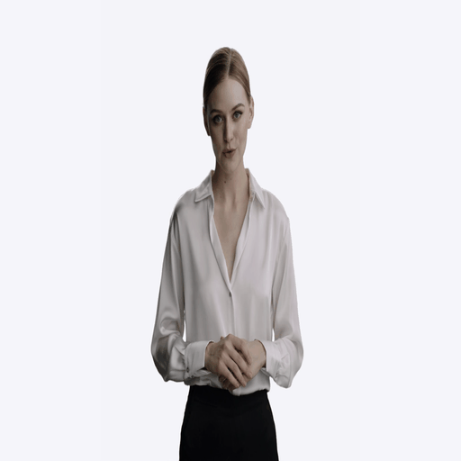
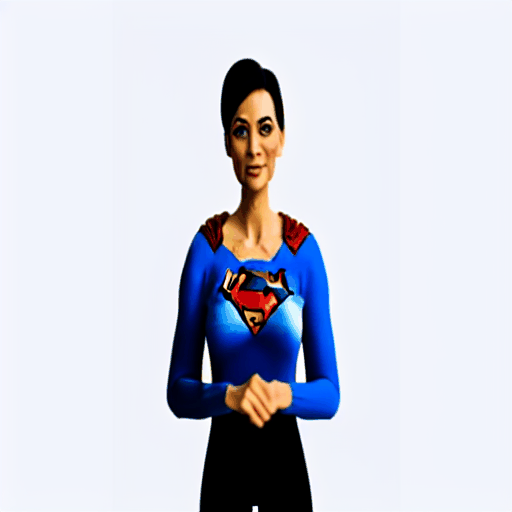

# Video editing with foundational stabel diffusion model

Stable diffusion model can generate images based on given input prompts, making a pretrianed diffusion model viable tool to edit images with conditions.
This pipeline is adapted from the work of Tune-A-Video ([github](https://github.com/zhuowenzhao/Tune-A-Video), [paper](https://arxiv.org/abs/2212.11565)) that is based on open-source [ Huggigface Diffusers](https://huggingface.co/docs/diffusers/index) and its [pretrained checkpoints](https://huggingface.co/CompVis/stable-diffusion-v1-4).

## Results
<table class="center">
<tr>
  <td style="text-align:center;"><b>Input Video</b></td>
  <td style="text-align:center;" colspan="3"><b>Output Video</b></td>
</tr>
<tr>
  <td></td>
  <td></td>
  <td></td>              
  <td></td>
</tr>
<tr>
  <td width=25% style="text-align:center;color:gray;">"A woman is talking"</td>
  <td width=25% style="text-align:center;">"A woman, wearing Superman clothes, is talking”</td>
  <td width=25% style="text-align:center;">"A woman, wearing Batman's mask, is talking"</td>
  <td width=25% style="text-align:center;">"A Wonder Woman is talking, cartoon style"</td>
</tr>
</table>


## The pipeline
### Set-ups
**Conda**

In a conda env, I installed `conda install Python==3.11` and the following:

```
pip install -r requirements.txt
```

**Docker Container**

I can also build a docker container to use GPUs for training and inferencing (postprocessing not included).
Build Docker image (inside the current folder):

```
docker build -t image_name -f ./docker/Dockerfile .
```
Launch a Docker image using the following command (if needed, `--network your_docker_network_name` to specify a network). You will have a running shell and access to NVIDIA GPUs. Then follow the instructions in the next sections. 

```
docker run --gpus all -it image_name
```


### Training:   
The input video will be decomposed into frame images.
The prompt and the images (in batches) will be embedded into latent vectors. The model is trained to semantically match these latent vectors going through cross-attention Unet architecture. 

1. Download stable diffusion mdoel and the pretrined weights.  
	  ```
	  ./download_models.sh
	  ```
  
2. Stongly suggest lanching accelerate jobs in terminal. First, configurate `Accelerate` for non/distributed training.

	```
	accelerate config
	```
2. Launch a training job.

	```
	accelerate launch train_tuneavideo.py --config='./configs/woman-talking.yaml'
	```

Some notes:
I have tried different image aspect ratios and resolutions, I think the best is (512, 512), which is the default image sizes of the pretrained model.
GPU memory is a bottelneck for the training (with A100 40GBs) since the model itself is quite huge. Due to resources limitation, I was only able to train videos with a total frames up to 16. 

### Inferencing:  
Once the training is done (modify `inference.py` if needed), do:

```
python inference.py
```
In this process,

1. New prompts will be embeded. The new latent vectors are initialized through DDIM inversion, providing structure guidance for sampling.
2. The new latent vectors will be used to reconstruct frames (the same dimension as input videos) through a VAE decoder.

### Postporcessing:  
It contains a few functionalites using module `moviepy`. See `postprocess.ipynb`.

1. An audio is extracted from the original video.
2. A new video is made by combining the audio and new video of the same duration.


